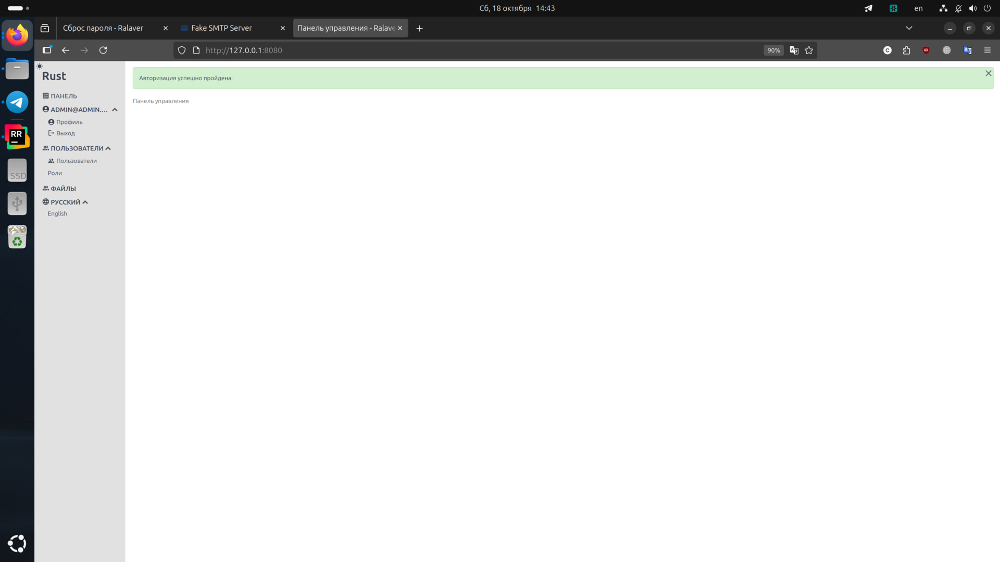

# Ralaver

Ralaver - это заготовка для веб-проектов на Rust. Я вдохновлялся Laravel, его простотой и количеством уже написанных функций. 
Название Ralaver появилось в следствии замены букв L на R в слове Laravel, так и получилось Ralaver.

В данные момент я оставил этот проект на неопределённый срок, чтобы заняться проектом на Golang. Но ничего страшного, 
Ralaver проект полон функций и довольно профессионально сделан. Пусть он и не идеален, но если взять его за основу, 
причесать, то его можно использовать в продакшене.  

В конце Readme.md вы можете увидеть скриншоты работающего приложения.

TODO. Исправить перед использованием в продакшене:
1) Перенести формирование данных для шаблонов в `src/app/view` как это сделано в [cvaize/galaveg](https://github.com/cvaize/galaveg);
2) Сократить объём кода валидаторов;
3) Во время работы в логах, вылазит какое-то уведомление, об ошибке. На работу не влияет, но стоит поправить. Может быть связано с работой крона.
4) Избавиться от вариативности connections, в статически типизированных языках не принято давать свободу выбора подключений к базам данных.
Лучше конкретизировать DB, Cache, KeyValue как это сделано в [cvaize/galaveg](https://github.com/cvaize/galaveg). Оставить шаблоны подключений 
для быстрой замены, но не входящие в скомпилированный образ.

Список возможностей:
1) Авторизация со сбросом пароля, через Cookie с шифрованием AES_256_CBC. Механизм скопирован из Laravel. За тем исключением, 
что я постарался уменьшить количество хранимых данных в сессии на бекенде. По этой же причине уведомления 
хранятся в куках (это немного не удобно, за то уменьшает нагрузку на сервер).
2) В качестве шаблонизатора используется Handlebars. Фронтенд построенный на простой (HTML+CSS с минимумом JS) вёрстке [cvaize/admin-front-template-1](https://github.com/cvaize/admin-front-template-1).
3) i18n. Языковые переменные и функции работающие с ними. Всё, что выводится пользователю, может быть переведено.
4) Уведомления и ошибки валидации через Cookie.
5) Валидация входных данных с использованием языковых переменных. Она немного громоздкая из-за языковых переменных. 
Но если вынести эту громоздкость в отдельные файлы, до можно от неё абстрагироваться.
6) Загрузка и управление файлами. Например: аватар пользователя и список файлов. Удаление файлов по времени пока не реализовано, но есть нужные поля.
7) Roles and Permissions - разделение доступа к приложению путём ролей и разрешений. 
8) RateLimit - ограничение на количество запросов.
9) Отправка E-mail сообщений.
10) Криптография - на ней основано шифрование данных Cookie авторизации (AES_256_CBC).
11) Хеширование - как base64, так и argon2id (используется для хеширования пароля).
12) MySQL + написаны абстракции для удобной работы с базой, частичного обновления полей данных и получения данных по связям.
В начале я использовал ORM, но увидев как сложно с ним работать и поддерживать, я решил писать прямые запросы в базу. 
Просто написал немного абстракций для удобства, если хотите, можете их опустить и писать напрямую.
13) Redis - стандартное KeyValue хранилище.
14) Model-View-Controller архитектура, только Model разделены на DTO, Services и Repositories.
DTO - это структуры, которые просто хранят и переносят данные.
Services - это сервисы, в которых сосредоточена бизнес логика.
Repositories - работают с внешними данным, для их получения и сохранения.
15) Есть заготовка выполнения в фоне через определённое количество секунд (файл src/main.rs).
16) Dark/Light Mode на фронте. По умолчанию используется тема пользователя, но можно переключить в ручном режиме на 
тёмную и светлую тему.
17) Миграции базы данных.

TODO:
1) Добавить систему логирования с возможностью доступа через web ui;
2) Исследовать и возможно добавить опциональное хранилище KeyValue написанное на Rust как альтернативу Redis, для ускорения работы в одно-серверных системах;
3) Написать генерируемую документацию и позаботиться о доступе к ней через web ui;
4) Сформировать CI/CD через файл для одно-серверных систем с запуском без докера;
5) Сформировать CI/CD через файл для одно-серверных систем с запуском через docker-compose;
6) Сформировать CI/CD через файл для k8s систем;
7) Сформировать CI/CD GitLab для одно-серверных систем с запуском без докера;
8) Сформировать CI/CD GitLab для одно-серверных систем с запуском через docker-compose;
9) Сформировать CI/CD GitLab для k8s систем;
10) Провести нагрузочное тестирование;
11) Постараться оптимизировать скорость исполнения ещё сильнее и сократить расход памяти путём уменьшения размеров типов переменных, там где это возможно;
12) Проверить безопасность подключенных библиотек вручную просмотрев их код;
13) Выпустить первый релиз;
14) Оформить статью на habr, а так же проконсультироваться с безопасниками касательно сборки.

## Среда разработки

Среда разработки состоит из:
1) rust:1.82.0
2) nodejs:22.13.1

### Команды бекенда
Перед запуском проекта создайте .env файл с переменными окружения из файла .env.example:
```shell
cp .env.example .env
```

Команда запуска среды разработки:
```shell
docker compose -f dev.docker-compose.yaml up -d
```

Команда остановки среды разработки:
```shell
docker compose -f dev.docker-compose.yaml down
```

Команда входа в среду разработки:
```shell
docker compose -f dev.docker-compose.yaml exec app bash
```
Эта команда будет полезна, например: для применения миграций.

Команда перезапуска среды разработки вместе со сборкой исходников:
```shell
docker compose -f dev.docker-compose.yaml down && docker compose -f dev.docker-compose.yaml up --build -d
```

Команда запуска приложения в среде разработки:
```shell
docker compose -f dev.docker-compose.yaml exec app cargo run
```

#### Миграции базы данных
Команда запуска миграций:
```shell
cargo run --bin migrate up
```
```shell
docker compose -f dev.docker-compose.yaml exec app cargo run --bin migrate up
```

Команда отката миграций:
```shell
cargo run --bin migrate down
```
```shell
docker compose -f dev.docker-compose.yaml exec app cargo run --bin migrate down
```


### Команды фронтенда
Команда для установки зависимостей фронтенда:
```shell
docker compose -f dev.docker-compose.yaml exec app npm i
```

Команда для сборки фронтенда (перед сборкой не забудьте установить зависимости):
```shell
docker compose -f dev.docker-compose.yaml exec app npm run build
```

Команда для перезаписи root владельца файлов:
```shell
sudo chown -R $UID:$UID .
```


Скриншоты:





