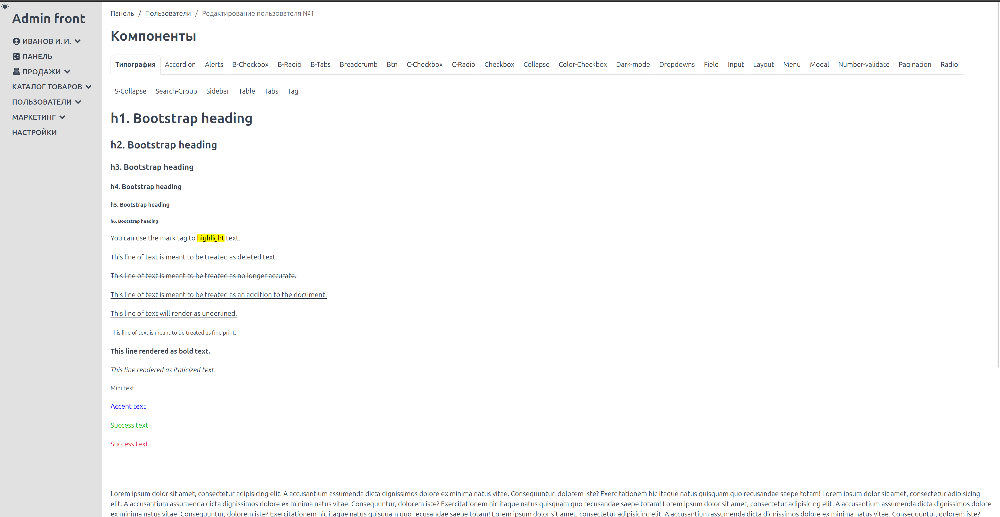
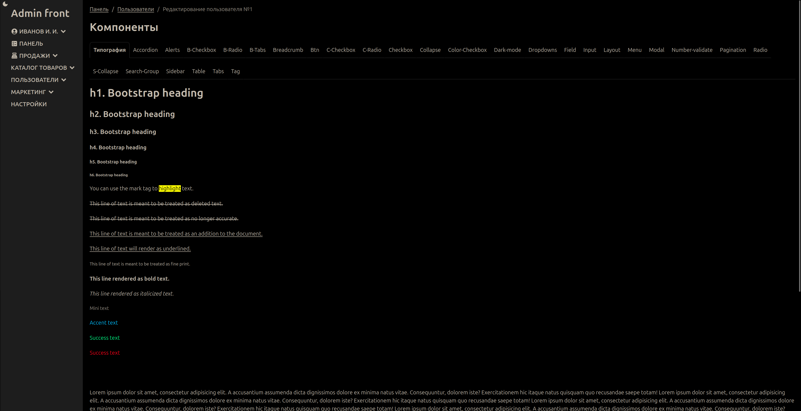
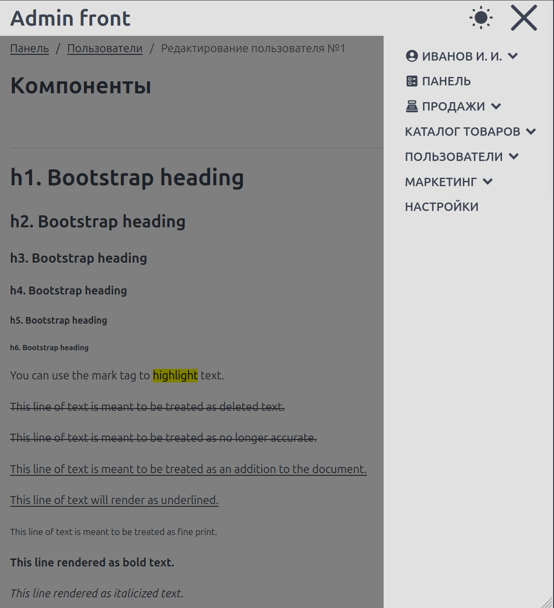
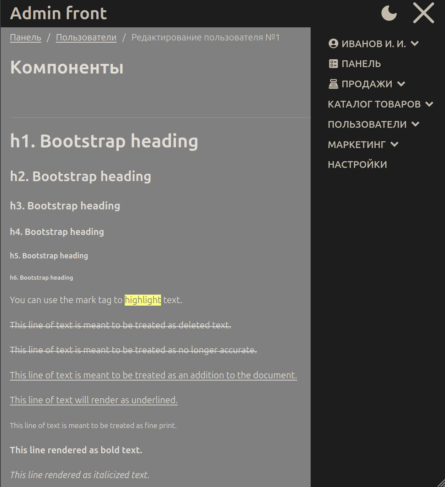
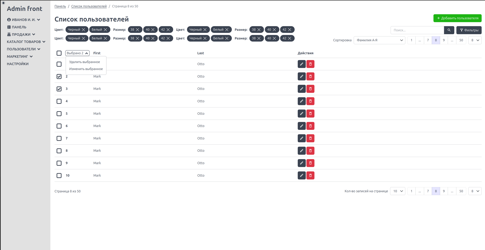
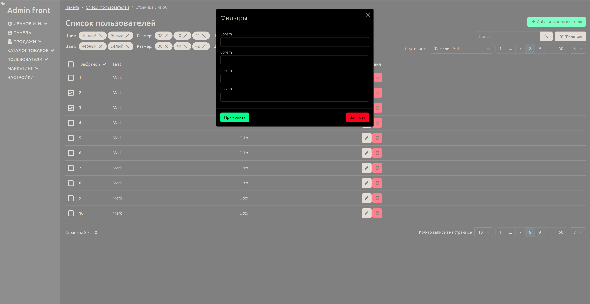
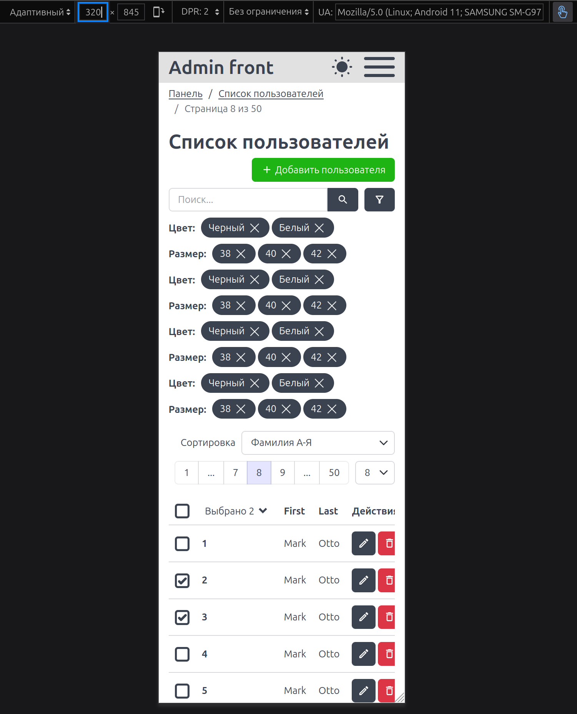

# Admin front v1 template

Only HTML+CSS+VanillaJS. 

Шаблон разделён на компоненты. Наименование css классов выполнено в стилистике БЭМ. 
Наименование css классов компонентов формируется по шаблону `[префикс][название компонента]`, например `admin-btn` 
где `admin-` - префикс, а `btn` - название компонента. Если компонентов одного вида много, например: много `checkbox`. 
То в таком случае добавляются латинские буквы от `a` до `z` согласно шаблону `[a-z]-[название компонента]`, 
например: `a-checkbox`, `b-checkbox`, `c-checkbox`. А классы в таком случае выглядят 
так: `admin-a-checkbox`, `admin-b-checkbox`, `admin-c-checkbox`.

Список готовых страниц шаблона:
1) [Главная](public/index.html)
2) [Вход](public/login.html)
3) [Регистрация](public/register.html)
4) [Сбросить пароль](public/reset-password.html)
5) [Подтверждение сброса пароля](public/reset-password-confirm.html)
6) [Список пользователей](public/list.html)
7) [Создание пользователя](public/create-edit.html)

Mode: Light/Dark

Icons for menu:
https://marella.github.io/material-design-icons/demo/font/

https://github.com/marella/material-design-icons

Images:

